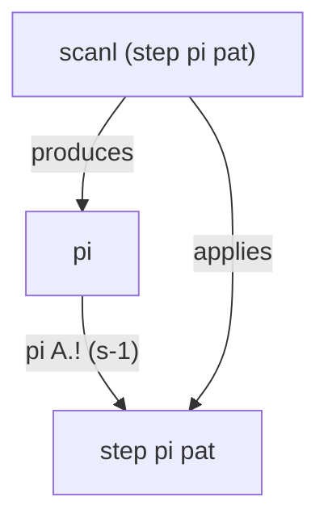
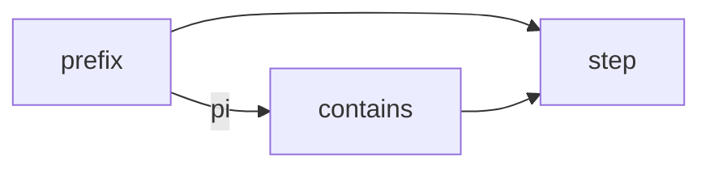

## The Prefix Function and KMP

The string matching problem: given a pattern $pat$ and text $txt$, find all occurrences of $pat$ in $txt$. The naive approach compares character by character, and on a mismatch rewinds both the pattern and text pointers — $O(nm)$ worst case.

**KMP's key insight**: the text pointer never needs to go backwards. If $k$ characters have been matched, then the first $k-1$ characters of the pattern are identical to the just-scanned portion of the text. This overlap lets us slide the pattern forward to the next viable position without re-scanning.

This "overlap information" is captured by the **prefix function** $\pi$. For a pattern $s[0:n]$ (all index intervals are half-open $[a,b)$), $\pi(i)$ is defined as:

$$
\pi(i) = \max_{k \in [0,i]}\big\{\,k \;\big|\; s[0:k] = s[i+1-k:i+1] \,\big\}
$$

That is, $\pi(i)$ is the length of the longest **proper prefix** of $s[0:i+1]$ that is also a **suffix**. $\pi(0)=0$.

Example: pattern `"aabaaab"` and its $\pi$:

| $i$ | 0 | 1 | 2 | 3 | 4 | 5 | 6 |
|-----|----|----|----|----|----|----|----|
| $s[i]$ | a | a | b | a | a | a | b |
| $\pi[i]$ | 0 | 1 | 0 | 1 | 2 | 2 | 3 |

Intuitively, $\pi(i)=k$ means $s[0:k]$ and $s[i+1-k:i+1]$ are identical. When a mismatch occurs at text position $j$ on character $s[k]$, we can keep the text pointer in place and **fall back** the pattern state to $\pi(k-1)$ instead of $0$ — because the first $\pi(k-1)$ characters have already been implicitly matched before the mismatch. This is what gives KMP its linear time.

---

## Haskell Implementation

```haskell
-- | Single-step transition: given prefix function pi, pattern pat,
-- current state s and character c, return the next state.
step :: (Eq tok) => A.Array Int Int -> A.Array Int tok -> Int -> tok -> Int
step pi pat s c
  | pat A.! s == c = s + 1                              -- match: advance
  | s == 0         = 0                                  -- at root: stop
  | otherwise      = step pi pat (pi A.! (s - 1)) c     -- follow pi failure chain
```

```haskell
-- | Prefix function pi, constructed in one pass via knot-tying with scanl.
prefix :: (Eq tok) => A.Array Int tok -> A.Array Int Int
prefix pat
  | null pat   = A.listArray (0, 0) [0]
  | otherwise  = pi
  where
    -- knot: pi shares the bounds of pat; scan step over itself to build it
    pi = A.listArray (A.bounds pat) (scanl (step pi pat) 0 (drop 1 (A.elems pat)))
```

```haskell
-- | KMP matching: compute pi with prefix, advance state with scanl, detect match with any.
contains :: (Eq tok) => A.Array Int tok -> [tok] -> Bool
contains pat = any (== n) . scanl (step pi pat) 0
  where
    pi = prefix pat
    n  = A.rangeSize (A.bounds pat)
```

`step` in four lines, `prefix` in four lines, `contains` in three lines. $\pi$ directly reuses `pat`'s bounds via `A.bounds pat` — no separate `n = length pat` variable is needed. The `for i = 1 to n-1` boilerplate that clutters traditional implementations is replaced by `scanl` + `drop 1` + `elems`.

---

## Code Analysis

### `step`

```haskell
step :: Array Int Int → Array Int tok → Int → tok → Int
```

$\pi$, pattern, current state → character → new state. On a match: advance. On a mismatch: follow the $\pi$ failure chain. At the root: stop.

`step` does not own $\pi$ or the pattern — both are explicit parameters. `prefix` passes in a $\pi$ under construction (the knot); `contains` passes in a $\pi$ already built (ordinary call). Same function, two uses.

### `prefix`

```haskell
pi = A.listArray (A.bounds pat) (scanl (step pi pat) 0 (drop 1 (A.elems pat)))
```

Two actions:

1. `scanl`, starting from $0$, applies `step pi pat` sequentially to $pat[1..n-1]$, producing $\pi(0), \pi(1), \dots, \pi(n-1)$
2. `pi` simultaneously serves as an input to `step` — the **knot**: $\pi$ uses `step` scanning itself to be constructed, while `step` needs $\pi$ to follow the failure chain

`pi` directly reuses `pat`'s bounds — `A.bounds pat` determines `pi`'s length, eliminating the need to manually pass $n$.



In a strictly-evaluated language (such as Rust or C++) this would be the paradox of "reading from an unfinished data structure." In Haskell, `Data.Array` is lazy in its boxed elements: `scanl` produces thunks one by one from left to right, and when `step` needs $\pi(j-1)$ (where $j-1 <$ the current index), that thunk has already been sequentially forced by `scanl`.

### `contains`

```haskell
contains pat = any (== n) . scanl (step pi pat) 0
  where
    pi = prefix pat
    n  = A.rangeSize (A.bounds pat)
```

`scanl (step pi pat) 0` drives `step pi pat` as a state machine across the text, producing a state sequence; `any (== n)` checks whether the accepting state $n$ is ever reached. `prefix` supplies $\pi$. The data flow among the three:



---

## Correctness Proof

Define $\pi$, $\mathrm{step}$, $\{p_i\}$, prove $\{p_i\} = \{\pi(i)\}$.

### Definitions

**Definition 1 (Prefix function)** For a string $s[0:n]$ (all index intervals are half-open $[a,b)$), $\pi : \{0,\dots,n-1\} \to \mathbb{N}$:

$$
\pi(i) = \begin{cases}
0, & i = 0 \\
\max\{\,k \in [0,i] \mid s[0:k] = s[i+1-k : i+1]\,\}, & i \ge 1
\end{cases}
$$

**Definition 2 (Transition function)** Given $s$ and its $\pi$, $\mathrm{step} : \mathbb{N} \times \Sigma \to \mathbb{N}$ (where $\Sigma$ is the alphabet):

$$
\mathrm{step}(j, c) = \begin{cases}
j + 1, & \text{if } s[j] = c \\[2pt]
0,     & \text{if } s[j] \neq c \;\land\; j = 0 \\[2pt]
\mathrm{step}(\pi(j-1),\, c), & \text{if } s[j] \neq c \;\land\; j > 0
\end{cases}
$$

**Definition 3 (scanl sequence)** The sequence $\{p_i\}_{i=0}^{n-1}$:

$$
p_i = \begin{cases}
0, & i = 0 \\
\mathrm{step}(p_{i-1},\, s[i]), & i \ge 1
\end{cases}
$$

That is, $[p_0,\dots,p_{n-1}] = \mathrm{scanl\ step\ 0}\ [s[1],\dots,s[n-1]]$.

### Theorem

**Theorem** $\forall i \in [0, n-1]:\; p_i = \pi(i)$.

*Proof.* By induction on $i$.

**Base case** $i = 0$: $p_0 = 0 = \pi(0)$. QED

**Inductive step** Assume $p_k = \pi(k)$ for all $k < i$ (strong induction). Let $j = p_{i-1} = \pi(i-1)$. Then $p_i = \mathrm{step}(j, s[i])$.

The definition of $\mathrm{step}$ has three branches; we proceed by case analysis on them:

---

**Case A** $s[j] = s[i]$.

Here $p_i = \mathrm{step}(j, s[i]) = j+1$. We prove $\pi(i) = j+1$.

($\ge$)
$$
\begin{aligned}
s[0:j] &= s[i-j:i] && [j = \pi(i-1)] \\
s[j] &= s[i] && [\text{premise}] \\[2pt]
\implies s[0:j+1] &= s[i-j:i+1] && [\text{append}] \\
\implies \pi(i) &\ge j+1 && [\text{def. of } \pi]
\end{aligned}
$$

($\le$)
$$
\begin{aligned}
k = \pi(i)
&\implies s[0:k] = s[i+1-k:i+1] && [\text{def. of } \pi] \\
&\implies s[0:k-1] = s[i+1-k:i] && [\text{drop last char}] \\
&\implies \pi(i-1) \ge k-1 && [\text{def. of } \pi] \\
&\implies j \ge k-1 && [\pi(i-1)=j] \\
&\implies k \le j+1 \\
&\implies \pi(i) \le j+1
\end{aligned}
$$

From $(\ge)(\le)$: $\pi(i) = j+1 = p_i$. QED

---

**Case B** $s[j] \neq s[i]$ and $j = 0$.

Here $p_i = \mathrm{step}(j, s[i]) = 0$. We prove $\pi(i) = 0$.

Let $M_m = \{\,k \mid s[0:k] = s[m+1-k:m+1]\,\}$, so $\pi(m) = \max M_m$.

From $\pi(i-1) = 0$:
$$
M_{i-1} = \{0\} \tag{1}
$$

For any $k \ge 1$:
$$
\begin{aligned}
k \in M_i
&\implies s[0:k] = s[i+1-k:i+1] && [\text{def. of } M_i] \\
&\implies s[0:k-1] = s[i+1-k:i] && [\text{drop last char}] \\
&\implies k-1 \in M_{i-1} && [\text{def. of } M_{i-1}] \\
&\implies k-1 = 0 && [\text{by (1)}] \\
&\implies k = 1
\end{aligned}
$$

Also:
$$
\begin{aligned}
1 \in M_i
&\iff s[0:1] = s[i:i+1] && [\text{def. of } M_i] \\
s[0] &= s[j] \neq s[i] && [j=0,\ \text{premise}] \\[2pt]
&\Downarrow \\
1 &\notin M_i
\end{aligned}
$$

Thus $M_i$ contains no $k \ge 1$. Since $0 \in M_i$ always (empty match):
$$
M_i = \{0\},\qquad \pi(i) = \max M_i = 0 = p_i
$$

QED

---

**Case C** $s[j] \neq s[i]$ and $j > 0$.

Here $p_i = \mathrm{step}(j, s[i]) = \mathrm{step}(\pi(j-1), s[i])$.

**(i) Show $\pi(i) \le j$** Let $k = \pi(i)$. If $k = 0$, then $k \le j$ holds trivially. Assume $k \ge 1$:

$$
\begin{aligned}
k = \pi(i)
&\implies s[0:k] = s[i+1-k:i+1] && [\text{def. of } \pi] \\
&\implies s[0:k-1] = s[i+1-k:i] && [\text{drop last char}] \\
&\implies \pi(i-1) \ge k-1 && [\text{def. of } \pi] \\
&\implies j \ge k-1 && [\pi(i-1)=j] \\
&\implies k \le j+1 && \text{(1)}
\end{aligned}
$$

Also:
$$
\begin{aligned}
s[0:k] = s[i+1-k:i+1] &\implies s[k-1] = s[i] && [\text{last char}] \\
s[j] \neq s[i] &\implies k-1 \neq j && [\text{premise}] \\
&\implies k \neq j+1 && \text{(2)}
\end{aligned}
$$

From (1)(2) and $k$ being an integer: $k \le j$, i.e. $\pi(i) \le j$.

**(ii) Express $\pi(i)$ in terms of $j$** Let $k = \pi(i)$, $k \le j$:

$$
\begin{aligned}
k = \pi(i)
&\iff s[0:k] = s[i+1-k:i+1] && [\text{def. of } \pi] \\
&\iff s[0:k-1] = s[i+1-k:i]\;\wedge\; s[k-1] = s[i] && [\text{split last char}] \\
&\iff s[0:k-1] = s[j+1-k:j]\;\wedge\; s[k-1] = s[i] && [\text{using } s[0:j]=s[i-j:i]]
\end{aligned}
$$

Hence:
$$
\pi(i) = \max\{\,k \mid s[0:k-1] = s[j+1-k:j],\; s[k-1] = s[i]\,\}
$$

Let $\ell = k-1$:
$$
\pi(i) = \max\{\,\ell+1 \mid s[0:\ell] = s[j-\ell:j],\; s[\ell] = s[i]\,\}
$$

(or $0$ if the set is empty).

Let the chain be $m_0 = \pi(j-1)$, $m_1 = \pi(m_0-1)$, \dots, $m_k = 0$. Unfold the recursive definition of $\mathrm{step}$:

$$
\begin{aligned}
\mathrm{step}(m_0, s[i])
&= \begin{cases}
m_0 + 1, & s[m_0] = s[i] \\
\mathrm{step}(m_1, s[i]), & s[m_0] \neq s[i]
\end{cases} \\
\mathrm{step}(m_1, s[i])
&= \begin{cases}
m_1 + 1, & s[m_1] = s[i] \\
\mathrm{step}(m_2, s[i]), & s[m_1] \neq s[i]
\end{cases} \\
&\;\;\vdots \\
\mathrm{step}(m_k, s[i]) &= 0 \qquad (m_k = 0)
\end{aligned}
$$

Substituting recursively: $\mathrm{step}(m_0, s[i]) = m_t + 1$, where $t$ is the smallest index with $s[m_t] = s[i]$ (or $0$ if none). Since $m_0 > m_1 > \dots > m_k$, this $m_t$ is the largest element of the chain satisfying the condition, hence:

$$
\mathrm{step}(\pi(j-1), s[i]) = \max\{\,\ell+1 \mid \ell \in \{\pi(j-1),\,\pi(\pi(j-1)-1),\,\dots,\,0\},\; s[\ell]=s[i]\,\}
$$

We must verify this chain equals $\{\,\ell \mid s[0:\ell] = s[j-\ell:j]\,\}$. Two inclusions:

$$
\begin{aligned}
\{\,\ell \mid s[0:\ell] = s[j-\ell:j]\,\} &\subseteq \{\pi(j-1),\,\pi(\pi(j-1)-1),\,\dots,\,0\} \\
\{\,\ell \mid s[0:\ell] = s[j-\ell:j]\,\} &\supseteq \{\pi(j-1),\,\pi(\pi(j-1)-1),\,\dots,\,0\}
\end{aligned}
$$

First prove $\supseteq$. For any $m_i$ on the chain:

$$
\begin{aligned}
m_i &= \pi(m_{i-1}-1) \\
&\implies s[0:m_i] = s[m_{i-1}-m_i:m_{i-1}] && [\text{def. of } \pi] \\
&\implies s[0:m_i] = s[j-m_i:j] && [\text{substitute } s[0:m_{i-1}]=s[j-m_{i-1}:j]]
\end{aligned}
$$

Hence $m_i \in \{\,\ell \mid s[0:\ell] = s[j-\ell:j]\,\}$.

Now prove $\subseteq$. Let $\ell$ satisfy $s[0:\ell]=s[j-\ell:j]$, and let $m_0 = \pi(j-1)$.

$$
\begin{aligned}
\ell &\le m_0 && [m_0 = \max\{\ell \mid s[0:\ell]=s[j-\ell:j]\}] \\
\ell < m_t &\implies s[0:\ell] = s[m_t-\ell:m_t] && [s[0:m_t]=s[j-m_t:j],\ \ell<m_t] \\
&\implies \ell \le \pi(m_t-1) = m_{t+1} && [\text{def. of } \pi] \\
&\implies \ell = m_{t+1} \lor \ell < m_{t+1}
\end{aligned}
$$

Since $\pi(m_t-1) < m_t$, the chain $m_0 > m_1 > m_2 > \dots > 0$ is strictly decreasing, so in **finitely many steps** we must have $\ell = m_t$ (for some $t$) or $\ell = 0$. Hence $\ell \in \{m_0,m_1,\dots,0\}$.

Therefore the two sets are equal:
$$
\{\,\ell \mid s[0:\ell] = s[j-\ell:j]\,\} = \{\pi(j-1),\,\pi(\pi(j-1)-1),\,\dots,\,0\}
$$

Substituting this equality:
$$
\mathrm{step}(\pi(j-1), s[i]) = \max\{\,\ell+1 \mid s[0:\ell]=s[j-\ell:j],\; s[\ell]=s[i]\,\}
$$

By strong induction all $\pi$ values on this chain are correct, so $\mathrm{step}(\pi(j-1), s[i]) = \pi(i)$.

Hence $p_i = \pi(i)$. QED

---

Thus, by mathematical induction, $\forall i:\; p_i = \pi(i)$. QED

---

## Lazy Evaluation

The `prefix` function contains an apparently circular dependency: `pi`'s definition references `step pi pat`, and `step`'s third argument is `pi` itself. In most languages this would crash immediately — you cannot read from a data structure that is still under construction.

The difference lies in **evaluation strategy**.

### Strict vs Lazy Evaluation

Mainstream languages (Rust, C++, Java, Python, etc.) use **strict evaluation** (also called eager evaluation): before a function is called, all its arguments must be fully computed to concrete values. Compute first, then call.

Haskell uses **lazy evaluation**: an expression is computed only when its result is **actually demanded**. Function arguments are not evaluated at the call site; instead they are packaged as **thunks** — deferred computations that say "figure this out when needed." Only when an operation must know the actual value of a thunk (e.g., pattern matching, output, arithmetic) does the runtime **force** the thunk, execute the computation, and replace the thunk with the result.

### Spines and Thunks

`Data.Array` in memory consists of two parts:

- **spine**: the index structure and bounds
- **elements**: the values in each slot

`A.listArray` evaluates the **spine** (to validate bounds), but does **not** evaluate the element values — each slot holds a thunk.

As `scanl` sweeps left to right over the pattern, it produces $\pi(0), \pi(1), \dots$ in order. Each $\pi(i)$ is a thunk. When `step` needs $\pi(j-1)$ (where $j-1 < i$), that thunk has already been forced by `scanl` in an earlier iteration into a concrete integer.

```
Timeline (scanl left to right):
  index 0: force thunk₀ → π(0)=0           ✓ no dependency
  index 1: force thunk₁ → step needs π(0)   ✓ π(0) ready
  index 2: force thunk₂ → step needs π(1)   ✓ π(1) ready
  ...
  index i: force thunkᵢ → step needs π(j-1) ✓ j-1 < i, ready
```

The key property: **the data dependency index is always less than the index currently being computed**. This guarantees the computation graph is **directed acyclic** — there is no true forward reference, only "referring to a prefix of the same array." Lazy evaluation allows this self-referential structure to be unwound left to right, with each step only reading from the already-computed prefix.

### Strictly-Evaluated Languages

In a strictly-evaluated language, `A.listArray` not only evaluates the spine but also forces **all elements immediately** — the array constructor requires each slot to be determinate at creation. At the moment $\pi$ is being constructed, the very first step of `scanl` needs to access $\pi$ (which doesn't exist yet), causing a deadlock.

Rust or C++ must use explicit two-pass loops, or manually maintain state with each iteration only accessing already-written positions. This is hand-coding the topological sort.

Haskell's lazy arrays delegate **topological sort to the runtime** — as long as data dependencies are forward ($j < i$), lazy evaluation automatically serializes the computation. The essence of knot-tying: **exploit the topological ordering of evaluation to transform a cyclic dependency into a directed acyclic computation graph.**

---

## Closing

The self-referential structure of KMP — $\pi(i)$ depending on $\pi(j)$ ($j < i$) — need not be worked around in a lazy language; it can be written as program text directly. `step` abstracts "following the failure chain" into a pure function, and `prefix` uses `scanl` to apply that same function simultaneously for construction and consumption. An instance of "expressing control flow through data flow" in functional programming.
