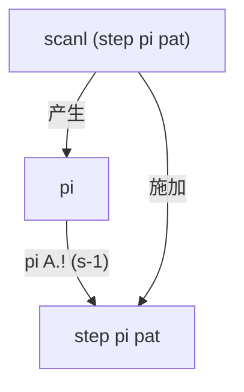
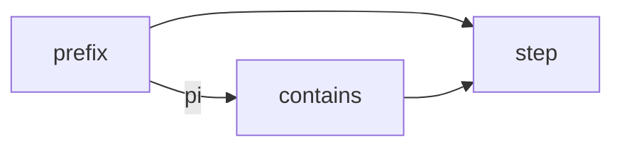

## 前缀函数与 KMP 算法

字符串匹配问题：给定模式串 $pat$ 和文本 $txt$，找出 $pat$ 在 $txt$ 中的所有出现位置。朴素做法逐字符比对，失配时模式串回退一位、文本指针也回退，最坏 $O(nm)$。

**KMP 的核心洞察**：失配时文本指针不必回退。如果已经匹配了 $k$ 个字符，那么模式串的前 $k-1$ 个字符和文本中刚扫描过的部分是相同的。利用这部分重叠信息，可以将模式串向前滑动到下一个可能匹配的位置，而不需要重新扫描文本。

这个"重叠信息"就是**前缀函数** $\pi$。对模式串 $s[0..n-1]$，$\pi(i)$ 定义为：

$$
\pi(i) = \max_{k=0..i}\big\{\,k \;\big|\; s[0..k-1] = s[i-(k-1)..i] \,\big\}
$$

也即 $\pi(i)$ 是 $s[0..i]$ 的最长**真前缀**同时也是**后缀**的长度。规定 $\pi(0)=0$。

例如模式串 `"aabaaab"` 的 $\pi$：

| $i$ | 0 | 1 | 2 | 3 | 4 | 5 | 6 |
|-----|----|----|----|----|----|----|----|
| $s[i]$ | a | a | b | a | a | a | b |
| $\pi[i]$ | 0 | 1 | 0 | 1 | 2 | 2 | 3 |

$\pi$ 的直观含义：$\pi(i)=k$ 意味着 $s[0..k-1]$ 和 $s[i-(k-1)..i]$ 完全相同。当在文本位置 $j$ 处 $s[k]$ 失配时，可以保持文本指针不动，将模式串状态**回退到** $\pi(k-1)$ 而不是 $0$——因为前 $\pi(k-1)$ 个字符已经在失配位置之前被隐式匹配过了。这就是 KMP 线性时间的来源。

---

## Haskell 实现：先看代码

只有三个函数。**直接可执行。**

```haskell
import qualified Data.Array as A

-- | 单步转移：给定前缀函数 pi、模式串 pat、当前状态 s 和字符 c，返回下一状态。
step :: (Eq tok) => A.Array Int Int -> A.Array Int tok -> Int -> tok -> Int
step pi pat s c
  | pat A.! s == c = s + 1                              -- 命中：前进
  | s == 0         = 0                                  -- 到根：停止
  | otherwise      = step pi pat (pi A.! (s - 1)) c     -- 沿 pi 失败链回跳

-- | 前缀函数 pi，通过 knot-tying 用 scanl 一步完成。
prefix :: (Eq tok) => A.Array Int tok -> A.Array Int Int
prefix pat
  | null pat   = A.listArray (0, 0) [0]
  | otherwise  = pi
  where
    -- knot: pi 与 pat 同边界，扫描 step 自身得出
    pi = A.listArray (A.bounds pat) (scanl (step pi pat) 0 (tail (A.elems pat)))

-- | KMP 匹配：prefix 算前缀函数，scanl 推进状态，any 检测命中。
contains :: (Eq tok) => A.Array Int tok -> [tok] -> Bool
contains pat = any (== n) . scanl (step pi pat) 0
  where
    pi = prefix pat
    n  = A.rangeSize (A.bounds pat)
```

**这就是全部。** `step` 四行，`prefix` 四行，`contains` 三行。$\pi$ 直接复用 `pat` 的边界（`A.bounds pat`），无需单独声明长度变量 `n`——传统实现中到处散落的 `n = length pat`、`for i = 1 to n-1` 在此被 `scanl` + `tail` + `elems` 内化。

---

## 代码拆解

### `step`：状态转移

`step` 是唯一理解 KMP 状态转移逻辑的地方。它的签名是：

```haskell
step :: Array Int Int → Array Int tok → Int → tok → Int
```

三个数据入参——$\pi$（`pi`）、模式串（`pat`）、当前状态——加一个字符，返回新状态。命中则前进，失配则沿 $\pi$ 失败链回跳，到根则停止。

关键设计：`step` **不拥有** $\pi$ 和模式串——它们都是显式入参。`prefix` 传入**正在构造中**的 $\pi$（knot），`contains` 传入**已经构造好**的 $\pi$（普通调用）。同一个 `step`，两种用法。

### `prefix`：以己为镜

```haskell
pi = A.listArray (A.bounds pat) (scanl (step pi pat) 0 (tail (A.elems pat)))
```

这一行包含两个动作：

1. `scanl` 从 $0$ 出发，将 `step pi pat` 顺序施加到 $pat[1..n-1]$ 上，产生 $\pi(0), \pi(1), \dots, \pi(n-1)$
2. `pi` 同时作为 `step` 的入参——这就是 **knot**：$\pi$ 用 `step` 扫描自身来构造，`step` 又需要 $\pi$ 来做失败链回跳

注意 `pi` 直接复用 `pat` 的边界——`A.bounds pat` 决定了 `pi` 的长度，省去了手动计算和传递 `n` 的麻烦。



在严格语言中这是"用未完成的数据结构读取自身"，是悖论。在 Haskell 中，`Data.Array` 对 boxed 元素是惰性的：`scanl` 自左向右逐个产生 thunk，当 `step` 需要 $\pi(j-1)$ 时（$j-1 <$ 当前索引），该 thunk 已被 `scanl` 顺序强制过。

### `contains`：扫描文本

```haskell
contains pat = any (== n) . scanl (step pi pat) 0
  where
    pi = prefix pat
    n  = A.rangeSize (A.bounds pat)
```

`scanl (step pi pat) 0` 将 `step pi pat` 作为状态机在文本上推进，生成状态序列；`any (== n)` 检查是否到达接受状态 $n$。`prefix` 提供 $\pi$。三者的数据流：



---

## 正确性证明

下面是严格的数学证明。我们定义三个数学对象——$\pi$、$\mathrm{step}$、$\{p_i\}$——然后证明 $\{p_i\}$ 恰好等于 $\{\pi(i)\}$。

### 定义

**定义 1（前缀函数）**　对字符串 $s[0:n]$（下标区间均为左闭右开 $[a,b)$），$\pi : \{0,\dots,n-1\} \to \mathbb{N}$：

$$
\pi(i) = \begin{cases}
0, & i = 0 \\
\max\{\,k \in [0,i] \mid s[0:k] = s[i+1-k : i+1]\,\}, & i \ge 1
\end{cases}
$$

**定义 2（转移函数）**　给定 $s$ 及其 $\pi$，$\mathrm{step} : \mathbb{N} \times \Sigma \to \mathbb{N}$（其中 $\Sigma$ 为字符集）：

$$
\mathrm{step}(j, c) = \begin{cases}
j + 1, & \text{若 } s[j] = c \\[2pt]
0,     & \text{若 } s[j] \neq c \;\land\; j = 0 \\[2pt]
\mathrm{step}(\pi(j-1),\, c), & \text{若 } s[j] \neq c \;\land\; j > 0
\end{cases}
$$

**定义 3（scanl 序列）**　序列 $\{p_i\}_{i=0}^{n-1}$：

$$
p_i = \begin{cases}
0, & i = 0 \\
\mathrm{step}(p_{i-1},\, s[i]), & i \ge 1
\end{cases}
$$

即 $[p_0,\dots,p_{n-1}] = \mathrm{scanl\ step\ 0}\ [s[1],\dots,s[n-1]]$。

### 定理

**定理**　$\forall i \in [0, n-1]:\; p_i = \pi(i)$。

*证明*　对 $i$ 归纳。

**基始** $i = 0$：$p_0 = 0 = \pi(0)$。证毕

**归纳步**　假设对所有 $k < i$ 已有 $p_k = \pi(k)$（强归纳）。令 $j = p_{i-1} = \pi(i-1)$。则 $p_i = \mathrm{step}(j, s[i])$。

$\mathrm{step}$ 的定义有三条分支，按此展开讨论：

---

**情况 A**　$s[j] = s[i]$。

此时 $p_i = \mathrm{step}(j, s[i]) = j+1$。下证 $\pi(i) = j+1$。

（$\ge$）
$$
\begin{aligned}
s[0:j] &= s[i-j:i] && [j = \pi(i-1)] \\
s[j] &= s[i] && [\text{前提}] \\[2pt]
\implies s[0:j+1] &= s[i-j:i+1] && [\text{拼接}] \\
\implies \pi(i) &\ge j+1 && [\pi\ \text{定义}]
\end{aligned}
$$

（$\le$）
$$
\begin{aligned}
k = \pi(i)
&\implies s[0:k] = s[i+1-k:i+1] && [\pi\ \text{定义}] \\
&\implies s[0:k-1] = s[i+1-k:i] && [\text{截末字符}] \\
&\implies \pi(i-1) \ge k-1 && [\pi\ \text{定义}] \\
&\implies j \ge k-1 && [\pi(i-1)=j] \\
&\implies k \le j+1 \\
&\implies \pi(i) \le j+1
\end{aligned}
$$

由 $(\ge)(\le)$：$\pi(i) = j+1 = p_i$。证毕

---

**情况 B**　$s[j] \neq s[i]$ 且 $j = 0$。

此时 $p_i = \mathrm{step}(j, s[i]) = 0$。下证 $\pi(i) = 0$。

令 $M_m = \{\,k \mid s[0:k] = s[m+1-k:m+1]\,\}$，则 $\pi(m) = \max M_m$。

由 $\pi(i-1) = 0$：
$$
M_{i-1} = \{0\} \tag{1}
$$

对任意 $k \ge 1$：
$$
\begin{aligned}
k \in M_i
&\implies s[0:k] = s[i+1-k:i+1] && [M_i\ \text{定义}] \\
&\implies s[0:k-1] = s[i+1-k:i] && [\text{截末字符}] \\
&\implies k-1 \in M_{i-1} && [M_{i-1}\ \text{定义}] \\
&\implies k-1 = 0 && [\text{由 (1)}] \\
&\implies k = 1
\end{aligned}
$$

又：
$$
\begin{aligned}
1 \in M_i
&\iff s[0:1] = s[i:i+1] && [M_i\ \text{定义}] \\
s[0] &= s[j] \neq s[i] && [j=0,\ \text{前提}] \\[2pt]
&\Downarrow \\
1 &\notin M_i
\end{aligned}
$$

综上，$M_i$ 中不存在 $k \ge 1$。而 $0 \in M_i$ 恒真（空匹配），故：
$$
M_i = \{0\},\qquad \pi(i) = \max M_i = 0 = p_i
$$

证毕

---

**情况 C**　$s[j] \neq s[i]$ 且 $j > 0$。

此时 $p_i = \mathrm{step}(j, s[i]) = \mathrm{step}(\pi(j-1), s[i])$。

由 $s[j] \neq s[i]$ 及 $\pi(i-1)=j$：
$$
\pi(i) \le j \tag{2}
$$

令 $k = \pi(i)$，$k \le j$。由 $\pi$ 定义：
$$
\begin{aligned}
s[0:k] &= s[i+1-k:i+1] \\
&\Downarrow \\
s[0:k-1] &= s[i+1-k:i] && [\text{截末字符}] \\
&= s[j+1-k:j] && [k \le j,\ \text{利用 } s[0:j]=s[i-j:i]] \\
&\Downarrow \\
k-1 &\in \{\,\ell \mid s[0:\ell] = s[j-\ell:j]\,\} \\
s[k-1] &= s[i] && [\text{匹配末字符}]
\end{aligned}
$$

因此：
$$
\pi(i) = \max\{\,\ell+1 \mid s[0:\ell] = s[j-\ell:j],\; s[\ell] = s[i]\,\}
$$

（空集则 $0$。）这正是 $\mathrm{step}$ 沿 $\pi$ 链
$\pi(j-1),\pi(\pi(j-1)-1),\dots,0$ 降序搜索的结果。
由强归纳链上所有 $\pi$ 值正确，故 $\mathrm{step}(\pi(j-1), s[i]) = \pi(i)$。

故 $p_i = \pi(i)$。证毕

---

综上，由数学归纳法，$\forall i:\; p_i = \pi(i)$。证毕

---

## 惰性求值：为什么这能工作

`prefix` 中出现了看似循环的依赖：`pi` 的定义引用了 `step pi pat`，而 `step` 的第三个参数就是 `pi` 自己。在大多数语言中，这行代码会立即崩溃——你无法使用一个尚未构造完成的数据结构。

要理解为什么 Haskell 可以，需要先理解**求值策略**的差异。

### 严格求值与惰性求值

主流语言（Rust、C++、Java、Python 等）采用**严格求值**（strict evaluation，也称及早求值 eager evaluation）：函数调用前，所有参数必须已经计算为确定的值。先算出结果，再传入函数。

Haskell 采用**惰性求值**（lazy evaluation）：表达式只在**真正需要其结果**时才计算。函数参数在传入时并不求值，而是打包成一个**thunk**——一段"等需要时再算"的延迟计算。只有当某个操作必须知道 thunk 的实际值（比如模式匹配、输出到屏幕、做算术运算）时，运行时才会**强制**（force）这个 thunk，执行计算并将 thunk 替换为结果。

### 什么是 spine？什么是 thunk？

以 `Data.Array` 为例。数组在内存中由两样东西组成：

- **spine**（骨架）：数组的索引结构和边界信息——"这是一个长度为 n 的数组"。
- **元素**：每个槽位里放的具体值。

`A.listArray` 的行为是：**求值 spine**（骨架结构）以校验边界是否合法，但**保留元素为 thunk**——每个槽位里放一个尚未计算、仅类型正确的表达式。

当 `scanl` 从左到右扫描模式串时，它依次产生 $\pi(0), \pi(1), \dots$。每个 $\pi(i)$ 都是一个 thunk，里面装着 `step pi pat` 应用到前一状态上的表达式。当 `step` 需要读取 $\pi(j-1)$ 时（$j-1 < i$），这个 thunk 已经被 `scanl` 在前面的迭代中强制过了——所以它已经是一个具体的整数，可以安全读取。

```
时间线（scanl 从左到右）：
  索引 0: 强制 thunk₀ → π(0)=0           ✓ 无依赖
  索引 1: 强制 thunk₁ → step 需要 π(0)    ✓ π(0) 已就绪
  索引 2: 强制 thunk₂ → step 需要 π(1)    ✓ π(1) 已就绪
  ...
  索引 i: 强制 thunkᵢ → step 需要 π(j-1)  ✓ j-1 < i，已就绪
```

关键性质：**数据依赖的索引始终小于当前正在计算的索引**。这保证了计算图是**有向无环**的——不存在真正的前向引用，只是"引用自身数组的前缀"。惰性求值让这种自引用结构可以从左到右依次解开，每一步都只读取已经计算好的前缀。

### 在其他语言中会怎样？

在严格求值的语言中，`A.listArray` 不仅要求值 spine，还要**立即求值所有元素**——数组构造器强制每个槽位在创建时就已就绪。这意味着构造 $\pi$ 的时刻，`scanl` 的每一步都要被立即计算，而第一步就需要访问 $\pi$（但 $\pi$ 还不存在），形成死锁。

Rust / C++ 中的 KMP 必须用显式的两趟循环：第一趟计算部分信息，第二趟补全——或者用 `for` 循环手动维护状态，每一次迭代只访问已经写入的位置。这是将"拓扑排序"手工编码进程序里。

Haskell 的惰性数组让程序员可以**把拓扑排序交给运行时**——只要保证数据依赖是前向的（$j < i$），惰性求值就能自动串行化计算。这正是 knot-tying 的本质：**利用求值顺序的拓扑性质，将循环依赖转化为有向无环的计算图。**

---

## 结语

```
step     — 转移逻辑（pi 和模式串均为显式入参，四行）
prefix   — 用 step 扫描自身，knot-tying 构造 pi（核心一行）
contains — 用 prefix + scanl + any 匹配文本（三行核心）
```

KMP 的自引用结构——$\pi(i)$ 依赖 $\pi(j)$（$j < i$）——在惰性语言中不是需要绕过的障碍，而是可以直接写出来的程序文本。`step` 把"跟随失败链"抽象为纯函数，`prefix` 用 `scanl` 将同一函数同时用于构造和使用。这是函数式编程中"用数据流表达控制流"的一个精妙例证。
