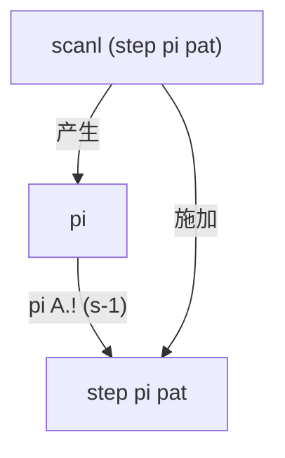
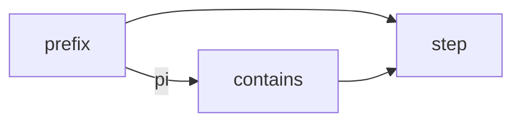

## 前缀函数与 KMP 算法

字符串匹配问题：给定模式串 $pat$ 和文本 $txt$，找出 $pat$ 在 $txt$ 中的所有出现位置。朴素做法逐字符比对，失配时模式串回退一位、文本指针也回退，最坏 $O(nm)$。

**KMP 的核心思想**：失配时文本指针不必回退。如果已经匹配了 $k$ 个字符，那么模式串的前 $k-1$ 个字符和文本中刚扫描过的部分是相同的。利用这部分重叠信息，可以将模式串向前滑动到下一个可能匹配的位置，而不需要重新扫描文本。

这个"重叠信息"就是**前缀函数** $\pi$。对模式串 $s[0:n]$（下标区间均为前闭后开 $[a,b)$），$\pi(i)$ 定义为：

$$
\pi(i) = \max_{k \in [0,i]}\big\{\,k \;\big|\; s[0:k] = s[i+1-k:i+1] \,\big\}
$$

也即 $\pi(i)$ 是 $s[0:i+1]$ 的最长**真前缀**同时也是**后缀**的长度。规定 $\pi(0)=0$。

例如模式串 `"aabaaab"` 的 $\pi$：

| $i$ | 0 | 1 | 2 | 3 | 4 | 5 | 6 |
|-----|----|----|----|----|----|----|----|
| $s[i]$ | a | a | b | a | a | a | b |
| $\pi[i]$ | 0 | 1 | 0 | 1 | 2 | 2 | 3 |

$\pi$ 的直观含义：$\pi(i)=k$ 意味着 $s[0:k]$ 和 $s[i+1-k:i+1]$ 完全相同。当在文本位置 $j$ 处 $s[k]$ 失配时，可以保持文本指针不动，将模式串状态**回退到** $\pi(k-1)$ 而不是 $0$——因为前 $\pi(k-1)$ 个字符已经在失配位置之前被隐式匹配过了。这就是 KMP 线性时间的来源。

---

## Haskell 实现

```haskell
import qualified Data.Array as A

-- | 单步转移：给定前缀函数 pi、模式串 pat、当前状态 s 和字符 c，返回下一状态。
step :: (Eq tok) => A.Array Int Int -> A.Array Int tok -> Int -> tok -> Int
step pi pat s c
  | pat A.! s == c = s + 1                              -- 命中：前进
  | s == 0         = 0                                  -- 到根：停止
  | otherwise      = step pi pat (pi A.! (s - 1)) c     -- 沿 pi 失败链回跳

-- | 前缀函数 pi，通过 knot-tying 用 scanl 一步完成。
prefix :: (Eq tok) => A.Array Int tok -> A.Array Int Int
prefix pat
  | null pat   = A.listArray (0, 0) [0]
  | otherwise  = pi
  where
    -- knot: pi 与 pat 同边界，扫描 step 自身得出
    pi = A.listArray (A.bounds pat) (scanl (step pi pat) 0 (drop 1 (A.elems pat)))

-- | KMP 匹配：prefix 算前缀函数，scanl 推进状态，any 检测命中。
contains :: (Eq tok) => A.Array Int tok -> [tok] -> Bool
contains pat = any (== n) . scanl (step pi pat) 0
  where
    pi = prefix pat
    n  = A.rangeSize (A.bounds pat)
```

`step` 四行，`prefix` 四行，`contains` 三行。$\pi$ 直接复用 `pat` 的边界（`A.bounds pat`），无需单独声明 $n$。传统实现中 `n = length pat`、`for i = 1 to n-1` 的模板代码被 `scanl` + `drop 1` + `elems` 取代。

---

## 代码分析

### `step`

```haskell
step :: Array Int Int → Array Int tok → Int → tok → Int
```

$\pi$、模式串、当前状态 → 字符 → 新状态。命中则前进，失配则沿 $\pi$ 失败链回跳，到根则停止。

`step` 不持有 $\pi$ 和模式串——二者均为显式入参。`prefix` 传入构造中的 $\pi$（knot），`contains` 传入已构造的 $\pi$（普通调用）。同一函数，两种用法。

### `prefix`

```haskell
pi = A.listArray (A.bounds pat) (scanl (step pi pat) 0 (drop 1 (A.elems pat)))
```

两个动作：

1. `scanl` 从 $0$ 开始，将 `step pi pat` 依次应用到 $pat[1..n-1]$，产生 $\pi(0),\pi(1),\dots,\pi(n-1)$
2. `pi` 同时是 `step` 的入参——**knot**：$\pi$ 用 `step` 扫描自身来构造，`step` 又需要 $\pi$ 做失败链回跳

`pi` 直接复用 `pat` 的边界——`A.bounds pat` 决定 `pi` 的长度，省去手动传递 $n$。



在严格求值的语言（如 Rust、C++）中这是"用未完成的数据结构读取自身"，是悖论。在 Haskell 中，`Data.Array` 对 boxed 元素是惰性的：`scanl` 自左向右逐个产生 thunk，当 `step` 需要 $\pi(j-1)$ 时（$j-1 <$ 当前索引），该 thunk 已被 `scanl` 顺序强制过。

### `contains`

```haskell
contains pat = any (== n) . scanl (step pi pat) 0
  where
    pi = prefix pat
    n  = A.rangeSize (A.bounds pat)
```

`scanl (step pi pat) 0` 在文本上驱动状态机，生成状态序列；`any (== n)` 检测是否抵达接受状态 $n$。`prefix` 提供 $\pi$。三者数据流：



---

## 正确性证明

定义 $\pi$、$\mathrm{step}$、$\{p_i\}$，证 $\{p_i\} = \{\pi(i)\}$。

### 定义

**定义 1（前缀函数）**　对字符串 $s[0:n]$（区间记号均为前闭后开 $[a,b)$），$\pi : \{0,\dots,n-1\} \to \mathbb{N}$：

$$
\pi(i) = \begin{cases}
0, & i = 0 \\
\max\{\,k \in [0,i] \mid s[0:k] = s[i+1-k : i+1]\,\}, & i \ge 1
\end{cases}
$$

**定义 2（转移函数）**　给定 $s$ 及其 $\pi$，$\mathrm{step} : \mathbb{N} \times \Sigma \to \mathbb{N}$（其中 $\Sigma$ 为字符集）：

$$
\mathrm{step}(j, c) = \begin{cases}
j + 1, & \text{若 } s[j] = c \\[2pt]
0,     & \text{若 } s[j] \neq c \;\land\; j = 0 \\[2pt]
\mathrm{step}(\pi(j-1),\, c), & \text{若 } s[j] \neq c \;\land\; j > 0
\end{cases}
$$

**定义 3（scanl 序列）**　序列 $\{p_i\}_{i=0}^{n-1}$：

$$
p_i = \begin{cases}
0, & i = 0 \\
\mathrm{step}(p_{i-1},\, s[i]), & i \ge 1
\end{cases}
$$

即 $[p_0,\dots,p_{n-1}] = \mathrm{scanl\ step\ 0}\ [s[1],\dots,s[n-1]]$。

### 定理

**定理**　$\forall i \in [0, n-1]:\; p_i = \pi(i)$。

*证明*　对 $i$ 归纳。

**基始** $i = 0$：$p_0 = 0 = \pi(0)$。证毕

**归纳步**　假设对所有 $k < i$ 有 $p_k = \pi(k)$（强归纳）。令 $j = p_{i-1} = \pi(i-1)$，则 $p_i = \mathrm{step}(j, s[i])$。

$\mathrm{step}$ 的定义有三条分支，按此展开讨论：

---

**情况 A**　$s[j] = s[i]$。

此时 $p_i = \mathrm{step}(j, s[i]) = j+1$。下证 $\pi(i) = j+1$。

（$\ge$）
$$
\begin{aligned}
s[0:j] &= s[i-j:i] && [j = \pi(i-1)] \\
s[j] &= s[i] && [\text{前提}] \\[2pt]
\implies s[0:j+1] &= s[i-j:i+1] && [\text{拼接}] \\
\implies \pi(i) &\ge j+1 && [\pi\ \text{定义}]
\end{aligned}
$$

（$\le$）
$$
\begin{aligned}
k = \pi(i)
&\implies s[0:k] = s[i+1-k:i+1] && [\pi\ \text{定义}] \\
&\implies s[0:k-1] = s[i+1-k:i] && [\text{截末字符}] \\
&\implies \pi(i-1) \ge k-1 && [\pi\ \text{定义}] \\
&\implies j \ge k-1 && [\pi(i-1)=j] \\
&\implies k \le j+1 \\
&\implies \pi(i) \le j+1
\end{aligned}
$$

由 $(\ge)(\le)$：$\pi(i) = j+1 = p_i$。证毕

---

**情况 B**　$s[j] \neq s[i]$ 且 $j = 0$。

此时 $p_i = \mathrm{step}(j, s[i]) = 0$。下证 $\pi(i) = 0$。

令 $M_m = \{\,k \mid s[0:k] = s[m+1-k:m+1]\,\}$，则 $\pi(m) = \max M_m$。

由 $\pi(i-1) = 0$：
$$
M_{i-1} = \{0\} \tag{1}
$$

对任意 $k \ge 1$：
$$
\begin{aligned}
k \in M_i
&\implies s[0:k] = s[i+1-k:i+1] && [M_i\ \text{定义}] \\
&\implies s[0:k-1] = s[i+1-k:i] && [\text{截末字符}] \\
&\implies k-1 \in M_{i-1} && [M_{i-1}\ \text{定义}] \\
&\implies k-1 = 0 && [\text{由 (1)}] \\
&\implies k = 1
\end{aligned}
$$

又：
$$
\begin{aligned}
1 \in M_i
&\iff s[0:1] = s[i:i+1] && [M_i\ \text{定义}] \\
s[0] &= s[j] \neq s[i] && [j=0,\ \text{前提}] \\[2pt]
&\Downarrow \\
1 &\notin M_i
\end{aligned}
$$

综上，$M_i$ 中不存在 $k \ge 1$。而 $0 \in M_i$ 恒真（空匹配），故：
$$
M_i = \{0\},\qquad \pi(i) = \max M_i = 0 = p_i
$$

证毕

---

**情况 C**　$s[j] \neq s[i]$ 且 $j > 0$。

此时 $p_i = \mathrm{step}(j, s[i]) = \mathrm{step}(\pi(j-1), s[i])$。

**（i）证 $\pi(i) \le j$**　设 $k = \pi(i)$。若 $k = 0$，则 $k \le j$ 平凡。下设 $k \ge 1$：

$$
\begin{aligned}
k = \pi(i)
&\implies s[0:k] = s[i+1-k:i+1] && [\pi\text{ 定义}] \\
&\implies s[0:k-1] = s[i+1-k:i] && [\text{截末字符}] \\
&\implies \pi(i-1) \ge k-1 && [\pi\text{ 定义}] \\
&\implies j \ge k-1 && [\pi(i-1)=j] \\
&\implies k \le j+1 && \text{(1)}
\end{aligned}
$$

又：
$$
\begin{aligned}
s[0:k] = s[i+1-k:i+1] &\implies s[k-1] = s[i] && [\text{末字符}] \\
s[j] \neq s[i] &\implies k-1 \neq j && [\text{前提}] \\
&\implies k \neq j+1 && \text{(2)}
\end{aligned}
$$

由 (1)(2) 及 $k$ 为整数：$k \le j$，即 $\pi(i) \le j$。

**（ii）将 $\pi(i)$ 用 $j$ 表示**　令 $k = \pi(i)$，$k \le j$：

$$
\begin{aligned}
k = \pi(i)
&\iff s[0:k] = s[i+1-k:i+1] && [\pi\text{ 定义}] \\
&\iff s[0:k-1] = s[i+1-k:i]\;\wedge\; s[k-1] = s[i] && [\text{拆末字符}] \\
&\iff s[0:k-1] = s[j+1-k:j]\;\wedge\; s[k-1] = s[i] && [\text{由 } s[0:j]=s[i-j:i]]
\end{aligned}
$$

故：
$$
\pi(i) = \max\{\,k \mid s[0:k-1] = s[j+1-k:j],\; s[k-1] = s[i]\,\}
$$

令 $\ell = k-1$：
$$
\pi(i) = \max\{\,\ell+1 \mid s[0:\ell] = s[j-\ell:j],\; s[\ell] = s[i]\,\}
$$

（空集则 $0$。）

记该链为 $m_0 = \pi(j-1)$，$m_1 = \pi(m_0-1)$，…，$m_k = 0$。展开 $\mathrm{step}$ 的递归定义：

$$
\begin{aligned}
\mathrm{step}(m_0, s[i])
&= \begin{cases}
m_0 + 1, & s[m_0] = s[i] \\
\mathrm{step}(m_1, s[i]), & s[m_0] \neq s[i]
\end{cases} \\
\mathrm{step}(m_1, s[i])
&= \begin{cases}
m_1 + 1, & s[m_1] = s[i] \\
\mathrm{step}(m_2, s[i]), & s[m_1] \neq s[i]
\end{cases} \\
&\;\;\vdots \\
\mathrm{step}(m_k, s[i]) &= 0 \qquad (m_k = 0)
\end{aligned}
$$

逐层代入得 $\mathrm{step}(m_0, s[i]) = m_t + 1$，其中 $t$ 是满足 $s[m_t] = s[i]$ 的最小下标（不存在则 $0$）。因 $m_0 > m_1 > \dots > m_k$，此 $m_t$ 是链中满足条件者的最大值，故：

$$
\mathrm{step}(\pi(j-1), s[i]) = \max\{\,\ell+1 \mid \ell \in \{\pi(j-1),\,\pi(\pi(j-1)-1),\,\dots,\,0\},\; s[\ell]=s[i]\,\}
$$

因此需确认该链等于 $\{\,\ell \mid s[0:\ell] = s[j-\ell:j]\,\}$。分两个方向证明该等式：

$$
\begin{aligned}
\{\,\ell \mid s[0:\ell] = s[j-\ell:j]\,\} &\subseteq \{\pi(j-1),\,\pi(\pi(j-1)-1),\,\dots,\,0\} \\
\{\,\ell \mid s[0:\ell] = s[j-\ell:j]\,\} &\supseteq \{\pi(j-1),\,\pi(\pi(j-1)-1),\,\dots,\,0\}
\end{aligned}
$$

先证 $\supseteq$。对链上任一 $m_i$：

$$
\begin{aligned}
m_i &= \pi(m_{i-1}-1) \\
&\implies s[0:m_i] = s[m_{i-1}-m_i:m_{i-1}] && [\pi\text{ 定义}] \\
&\implies s[0:m_i] = s[j-m_i:j] && [\text{代入 } s[0:m_{i-1}]=s[j-m_{i-1}:j]]
\end{aligned}
$$

故 $m_i \in \{\,\ell \mid s[0:\ell] = s[j-\ell:j]\,\}$。

再证 $\subseteq$。设 $\ell$ 满足 $s[0:\ell]=s[j-\ell:j]$，记 $m_0 = \pi(j-1)$。

$$
\begin{aligned}
\ell &\le m_0 && [m_0 = \max\{\ell \mid s[0:\ell]=s[j-\ell:j]\}] \\
\ell < m_t &\implies s[0:\ell] = s[m_t-\ell:m_t] && [s[0:m_t]=s[j-m_t:j],\ \ell<m_t] \\
&\implies \ell \le \pi(m_t-1) = m_{t+1} && [\pi\text{ 定义}] \\
&\implies \ell = m_{t+1} \lor \ell < m_{t+1}
\end{aligned}
$$

由 $\pi(m_t-1) < m_t$ 知链 $m_0 > m_1 > m_2 > \dots > 0$ 严格递减，因此有限步内必有 $\ell = m_t$（对某 $t$）或 $\ell = 0$，即 $\ell \in \{m_0,m_1,\dots,0\}$。

因此两集合相等：
$$
\{\,\ell \mid s[0:\ell] = s[j-\ell:j]\,\} = \{\pi(j-1),\,\pi(\pi(j-1)-1),\,\dots,\,0\}
$$

代入该等式：
$$
\mathrm{step}(\pi(j-1), s[i]) = \max\{\,\ell+1 \mid s[0:\ell]=s[j-\ell:j],\; s[\ell]=s[i]\,\}
$$

由强归纳，链上每个 $\pi$ 值均已得证，故 $\mathrm{step}(\pi(j-1), s[i]) = \pi(i)$。

故 $p_i = \pi(i)$。证毕

---

综上，由数学归纳法，$\forall i:\; p_i = \pi(i)$。证毕

---

## 惰性求值

`prefix` 中出现了看似循环的依赖：`pi` 的定义引用了 `step pi pat`，而 `step` 的第三个参数正是 `pi` 自身。在大多数语言中，这行代码会立即崩溃——无法使用尚未构造完成的数据结构。

原因在于**求值策略**的差异。

### 严格求值与惰性求值

主流语言（Rust、C++、Java、Python 等）采用**严格求值**（strict/eager evaluation）：函数调用前所有参数必须计算为确定的值。先算结果，再传参数。

Haskell 采用**惰性求值**（lazy evaluation）：表达式只在**结果被需要**时才计算。函数参数传入时并不求值，而是打包为一个**thunk**——"等需要时再算"的延迟计算。当某个操作需要 thunk 的实际值（如模式匹配、输出、算术运算）时，运行时才**强制**（force）这个 thunk，执行计算并替换为结果。

### spine 与 thunk

`Data.Array` 在内存中由两部分组成：

- **spine**：索引结构与边界信息
- **元素**：各槽位的值

`A.listArray` **求值 spine**（校验边界合法性），但**保留元素为 thunk**——每个槽位放一个尚未计算的表达式。

`scanl` 从左到右扫描模式串时，依次产生 $\pi(0),\pi(1),\dots$。每个 $\pi(i)$ 是一个 thunk。当 `step` 需要 $\pi(j-1)$ 时（$j-1 < i$），该 thunk 已被 `scanl` 在前面的迭代中强制为具体整数。

```
时间线（scanl 从左到右）：
  索引 0: 强制 thunk₀ → π(0)=0           ✓ 无依赖
  索引 1: 强制 thunk₁ → step 需要 π(0)    ✓ π(0) 已就绪
  索引 2: 强制 thunk₂ → step 需要 π(1)    ✓ π(1) 已就绪
  ...
  索引 i: 强制 thunkᵢ → step 需要 π(j-1)  ✓ j-1 < i，已就绪
```

关键性质：**数据依赖索引始终小于当前计算索引**。故计算图是**有向无环**的——不存在前向引用，仅为"引用自身数组的前缀"。惰性求值让这种自引用结构可自左向右依次解开，每一步只读已计算部分。

### 严格求值语言的对比

在严格求值的语言中，`A.listArray` 不仅求值 spine，还会**立即求值所有元素**——数组构造器要求各槽位在创建时即确定。构造 $\pi$ 时 `scanl` 第一步就需要访问 $\pi$（但 $\pi$ 还不存在），形成死锁。

Rust / C++ 的 KMP 必须用两趟循环，或手动维护状态、每次只访问已写入位置。这是手动编码"拓扑排序"。

Haskell 的惰性数组将**拓扑排序交给运行时**——数据依赖前向（$j < i$）即可自动串行化。knot-tying 的本质：**利用求值顺序的拓扑性质，将循环依赖转化为有向无环计算图。**

---

## 结语

KMP 的自引用结构——$\pi(i)$ 依赖 $\pi(j)$（$j < i$）——在惰性语言中不必绕开，可直接写为程序文本。`step` 将"跟随失败链"抽象为纯函数，`prefix` 用 `scanl` 将同一函数同时用于构造与使用。函数式编程"以数据流表达控制流"的一则例证。
